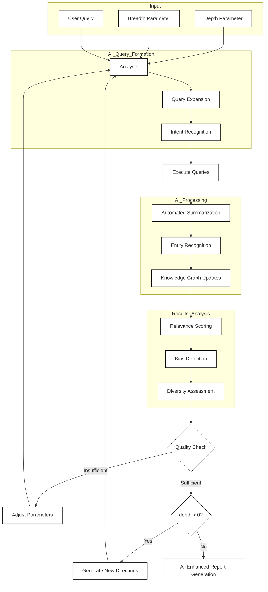

### Blizzer DeepResearch

#### Introduction

Welcome to our Deep Research Tool This project aims to provide accurate and comprehensive research results through an iterative process. Below is a detailed overview of how our tool works, along with a flowchart illustrating the process.

#### Table of Contents

- **Introduction**
- **How It Works**
- **Flowchart**
- **Getting Started**
- **Contributing**
- **License**
- **Acknowledgments**

#### How It Works

Our deep research tool leverages AI to perform iterative research, ensuring that each step is meticulously planned and executed to provide the most precise results possible.

1. **Input Parameters:**
   - **Depth Parameter:** Controls how deeply we dive into the topic.
   - **Breadth Parameter:** Determines the scope of our research, covering a wide range of related topics.
   - **User Query:** The starting point for our investigation, which we refine as we gather more information.

2. **AI-Powered Query Formation:**
   - **Analysis:** We analyze the user query to extract key concepts and refine it for better results.
   - **Query Expansion:** Based on the analysis, we expand the query to include synonyms, related terms, and alternative phrasings.
   - **Intent Recognition:** We identify the underlying intent behind the user's query to ensure we're addressing their specific needs.

3. **Execute Queries:**
   Using the refined query, we execute targeted searches across various data sources, including web scraping and large language models.

4. **Automated Summarization & Entity Recognition:**
   We process the search results using automated summarization techniques to extract the most relevant information. Entity recognition helps us identify key entities such as people, organizations, and locations.

5. **Knowledge Graph Updates:**
   The extracted information is then integrated into a knowledge graph, which provides a structured representation of the entities and their relationships.

6. **Results Analysis:**
    We analyze the results to determine their relevance and accuracy. This involves:
    - **Relevance Scoring:** Assessing how well the results match the user's query.
    - **Bias Detection:** Identifying potential biases in the results to ensure fairness.
    - **Diversity Assessment:** Evaluating the diversity of sources to ensure a comprehensive view.

7. **Quality Check & Parameter Adjustment:**
    If necessary, we adjust our parameters based on the quality of the results. This might involve refining our query further or adjusting our depth and breadth settings.

8. **Iterative Refinement:**
    If the depth parameter is greater than zero, we generate new directions based on prior goals, new questions, and learnings from previous iterations. This ensures that our research remains focused and relevant.

9. **Final Output:**
    Once we've reached the desired depth, we generate an AI-enhanced report that includes detailed findings and sources. This report is designed to provide quick, precise answers to the user's query.

#### Flowchart

Here’s a visual representation of our iterative research process using a flowchart:

#### Contributing

We welcome contributions to our project If you'd like to contribute, please follow these steps:

1. **Fork the repository:** Create a fork of this repository on GitHub.
2. **Clone the forked repository:** Clone your forked repository to your local machine.
3. **Create a new branch:** Create a new branch for your contribution.
4. **Make changes:** Make the necessary changes and commit them.
5. **Push changes to your branch:** Push your changes to your branch on GitHub.
6. **Open a pull request:** Open a pull request from your branch to the main branch.

#### License

This project is licensed under MIT LICENSE. For more information, please refer to the LICENSE file in this repository.

#### Acknowledgments

We would like to thank all contributors who have helped make this project possible. Your contributions are greatly appreciated!

---

By following these steps and using our flowchart as a guide, you can effectively utilize our Deep Research Tool to achieve accurate and comprehensive research results.
